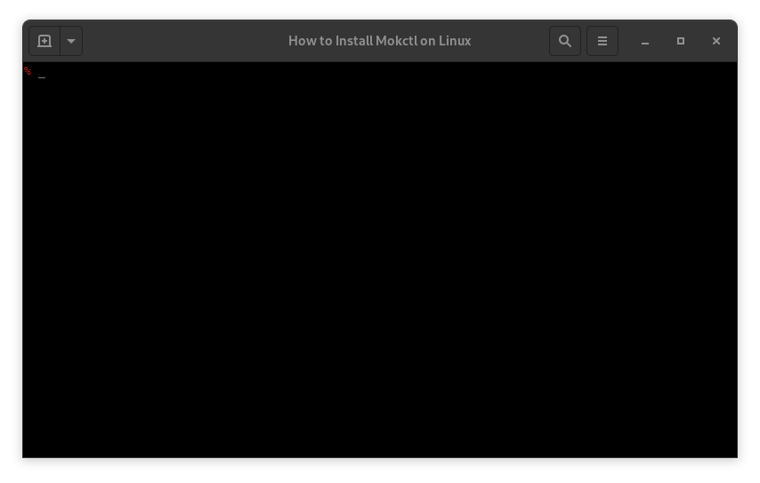

# Install mokctl on Linux



View the [screencast file](../cmdline-player/install-mokctl-linux.scr)

```bash
# How to install and use mokctl
lsb_release -d
sudo npm install -g my-own-kind
alias mokctl="sudo mokctl"
mokctl build image --get-prebuilt-image
# Let's create a 7 node kubernetes cluster, this will take a couple minutes...
mokctl create cluster myk8s --with-lb --masters 3 --workers 3
export KUBECONFIG=/var/tmp/admin.conf
kubectl get pods -A
for i in {10..1}; do echo -n "$i.."; sleep 1; done; echo
kubectl get pods -A
for i in {10..1}; do echo -n "$i.."; sleep 1; done; echo
kubectl get pods -A
# Kubernetes looks about ready :)
# Let's try starting a Pod:
kubectl run --rm -ti --restart=Never --image=alpine shell2 sh
ip address
apk add fortune
# 'apk add' downloads from the Internet, so networking and external dns looks ok
fortune
exit
mokctl get cluster
# Now to delete the cluster we just made:
mokctl delete cluster myk8s
y
mokctl get cluster
# And uninstall mokctl
sudo npm uninstall -g my-own-kind
# That's it for now...
# Thanks for watching!
```
